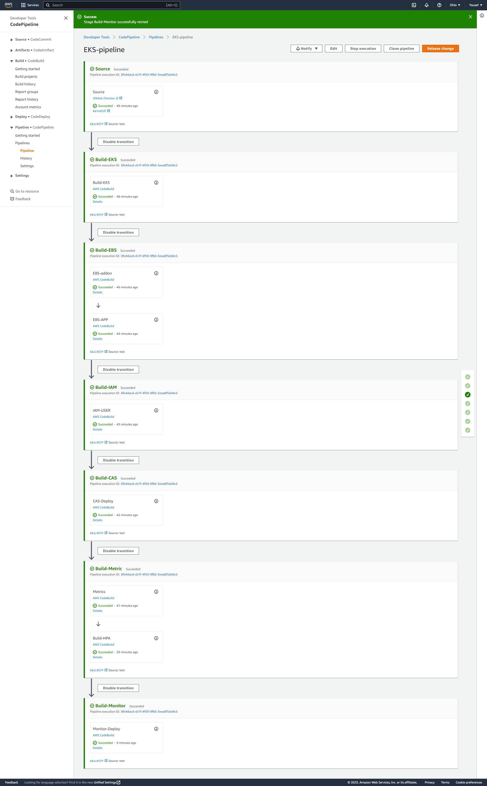

## AWS CodePipeline+CodeBuild using Terraform to make automation process for Python Task

**we use AWS CodePipeline to make automatically test,build and deploy python app (Cluster health check) as the follwoing steps:**




#### Step 00: We define Terraform Settings and provider `c1-version.tf`

```
terraform {
  required_version = ">= 1.0.0"
   required_providers {
    aws = {
      source = "hashicorp/aws"
      version = "4.48.0"
     }
   }

  # Adding Backend as S3 for Remote State Storage
  backend "s3" {
    bucket = "aws-eks-terraform-2"
    key    = "dev/py-pipelinee-eks/terraform.tfstate"
    region = "us-east-2" 

    # For State Locking
    dynamodb_table = "py-pipeline-eks"    
  }    


}

provider "aws" {
  region = var.aws_region
}

```

#### Step 01: We define Github Source as Connection for Pipeline `c2-source.tf`


```

resource "aws_codestarconnections_connection" "github" {
  name = "github-connection"
  provider_type = "GitHub"
  #provider_version = "2"
  #host_arn = "arn:aws:codestar-connections:us-east-1:962490649366:connection/efs-1"
 # host_arn = aws_codestar_connections_host.github.arn
  #access_token_arn = "arn:aws:secretsmanager:REGION:ACCOUNT_ID:secret:GITHUB_SECRET_NAME"
 # access_token_arn = "arn:aws:secretsmanager:REGION:ACCOUNT_ID:secret:GITHUB_SECRET_NAME"

}


```


#### Step 02: We define IAM roles and Polices for AWS CodePipeline and CodeBuild `c3-iam-role-policy.tf`


```
resource "aws_iam_role" "containerAppBuildProjectRole" {
  name = "containerAppBuildProjectRole"

  assume_role_policy = <<EOF
{
  "Version": "2012-10-17",
  "Statement": [
    {
      "Effect": "Allow",
      "Principal": {
        "Service": "codebuild.amazonaws.com"
      },
      "Action": "sts:AssumeRole"
    }
  ]
}
EOF
}

# add managed Polcy
# IAM full access

resource "aws_iam_policy_attachment" "IAMFullAccess" {
  name       = "IAMFullAccess"
  policy_arn = "arn:aws:iam::aws:policy/IAMFullAccess"
  roles      = [aws_iam_role.containerAppBuildProjectRole.name]
}

# S3 Full access
resource "aws_iam_policy_attachment" "AmazonS3FullAccess" {
  name       = "AmazonS3FullAccess"
  policy_arn = "arn:aws:iam::aws:policy/AmazonS3FullAccess"
  roles      = [aws_iam_role.containerAppBuildProjectRole.name]
}

# DynamoDB full access
resource "aws_iam_policy_attachment" "AmazonDynamoDBFullAccess" {
  name       = "AmazonDynamoDBFullAccess"
  policy_arn = "arn:aws:iam::aws:policy/AmazonDynamoDBFullAccess"
  roles      = [aws_iam_role.containerAppBuildProjectRole.name]
}


resource "aws_iam_role" "apps_codepipeline_role" {
  name = "apps-code-pipeline-role"

  assume_role_policy = <<EOF
{
  "Version": "2012-10-17",
  "Statement": [
    {
      "Effect": "Allow",
      "Principal": {
        "Service": "codepipeline.amazonaws.com"
      },
      "Action": "sts:AssumeRole"
    }
  ]
}
EOF
}

```


#### Step 03: We define AWS CodeBuild Projects for Pipeline `c4-build.tf`


```
# aws codebuild - First - python and auth with K8s  ************************************

resource "aws_codebuild_project" "EKSBuild" {
  badge_enabled  = false
  build_timeout  = 60
  name           = "EKS-Cluster"


  queued_timeout = 480
  service_role   = aws_iam_role.containerAppBuildProjectRole.arn
  tags = {
    Environment = var.env
  }

  artifacts {
    encryption_disabled = false
    # name                   = "container-app-code-${var.env}"
    # override_artifact_name = false
    packaging = "NONE"
    type      = "CODEPIPELINE"
  }


  environment {
    compute_type                = "BUILD_GENERAL1_SMALL"
    image                       = "aws/codebuild/standard:6.0"
    image_pull_credentials_type = "CODEBUILD"
    privileged_mode             = true
    type                        = "LINUX_CONTAINER"
    # environment_variable {
    #           name  = "IMAGE_REPO_NAME"
    #           type  = "PLAINTEXT"
    #           value = "yousefshaban/my-python-app"
    # }

    # environment_variable {
    #           name  = "IMAGE_TAG"
    #           type  = "PLAINTEXT"
    #           value = "latest"
    # }


  }


  logs_config {
    cloudwatch_logs {
      status = "ENABLED"
    }

    s3_logs {
      encryption_disabled = false
      status              = "DISABLED"
    }
  }

# how we can dd more source for aws_codebuild_project

  source {

    buildspec  = "${file("buildspec_eks-1.yml")}"
    git_clone_depth     = 0
    insecure_ssl        = false
    report_build_status = false
  #  type                = "CODEPIPELINE"
    type                = "CODEPIPELINE"
  }
}


#aws codeBuild - Project 2-1 - Install EBS  *********************************************
resource "aws_codebuild_project" "containerAppBuild_ebs" {
  badge_enabled  = false
  build_timeout  = 60
  name           = "eks-ebs"

  queued_timeout = 480
  service_role   = aws_iam_role.containerAppBuildProjectRole.arn
  tags = {
    Environment = var.env
  }

  artifacts {
    encryption_disabled = false
    packaging = "NONE"
    type      = "CODEPIPELINE"
  }
environment {
    compute_type                = "BUILD_GENERAL1_SMALL"
    image                       = "aws/codebuild/standard:6.0"
    image_pull_credentials_type = "CODEBUILD"
    privileged_mode             = true
    type                        = "LINUX_CONTAINER"
  }

  logs_config {
    cloudwatch_logs {
      status = "ENABLED"
    }

    s3_logs {
      encryption_disabled = false
      status              = "DISABLED"
    }
  }

  source {
    # buildspec           = data.template_file.buildspec.rendered
    buildspec  = "${file("buildspec_eks-ebs-2.yml")}"
    git_clone_depth     = 0
    insecure_ssl        = false
    report_build_status = false
    type                = "CODEPIPELINE"
  }
}

#aws codeBuild - Project 2-2 - deploy app to check EBS  *********************************************
resource "aws_codebuild_project" "containerAppBuild_ebs_app" {
  badge_enabled  = false
  build_timeout  = 60
  name           = "ebs_app"

  queued_timeout = 480
  service_role   = aws_iam_role.containerAppBuildProjectRole.arn
  tags = {
    Environment = var.env
  }

  artifacts {
    encryption_disabled = false
    packaging = "NONE"
    type      = "CODEPIPELINE"
  }
environment {
    compute_type                = "BUILD_GENERAL1_SMALL"
    image                       = "aws/codebuild/standard:6.0"
    image_pull_credentials_type = "CODEBUILD"
    privileged_mode             = true
    type                        = "LINUX_CONTAINER"
  }

  logs_config {
    cloudwatch_logs {
      status = "ENABLED"
    }

    s3_logs {
      encryption_disabled = false
      status              = "DISABLED"
    }
  }

  source {
    # buildspec           = data.template_file.buildspec.rendered
    buildspec  = "${file("buildspec_eks-ebs-2-2.yml")}"
    git_clone_depth     = 0
    insecure_ssl        = false
    report_build_status = false
    type                = "CODEPIPELINE"
  }
}


#aws codeBuild - Project 3 - 3-EKS-DeveloperAccess-IAM-Users 3-k8sresources-terraform-manifests  *********************************************

resource "aws_codebuild_project" "containerAppBuild_iam" {
  badge_enabled  = false
  build_timeout  = 60
  name           = "eks-iam"

  queued_timeout = 480
  service_role   = aws_iam_role.containerAppBuildProjectRole.arn
  tags = {
    Environment = var.env
  }

  artifacts {
    encryption_disabled = false
    packaging = "NONE"
    type      = "CODEPIPELINE"
  }
environment {
    compute_type                = "BUILD_GENERAL1_SMALL"
    image                       = "aws/codebuild/standard:6.0"
    image_pull_credentials_type = "CODEBUILD"
    privileged_mode             = true
    type                        = "LINUX_CONTAINER"
  }

  logs_config {
    cloudwatch_logs {
      status = "ENABLED"
    }

    s3_logs {
      encryption_disabled = false
      status              = "DISABLED"
    }
  }

  source {
    # buildspec           = data.template_file.buildspec.rendered
    buildspec  = "${file("buildspec_eks-iam-3.yml")}"
    git_clone_depth     = 0
    insecure_ssl        = false
    report_build_status = false
    type                = "CODEPIPELINE"
  }
}


#aws codeBuild - project 4 -  4-EKS-Cluster-Autoscaler  4.1 install CAS  *********


resource "aws_codebuild_project" "containerAppBuild_cas" {
  badge_enabled  = false
  build_timeout  = 60
  name           = "cas"

  queued_timeout = 480
  service_role   = aws_iam_role.containerAppBuildProjectRole.arn
  tags = {
    Environment = var.env
  }

  artifacts {
    encryption_disabled = false
    packaging = "NONE"
    type      = "CODEPIPELINE"
  }
environment {
    compute_type                = "BUILD_GENERAL1_SMALL"
    image                       = "aws/codebuild/standard:6.0"
    image_pull_credentials_type = "CODEBUILD"
    privileged_mode             = true
    type                        = "LINUX_CONTAINER"
  }

  logs_config {
    cloudwatch_logs {
      status = "ENABLED"
    }

    s3_logs {
      encryption_disabled = false
      status              = "DISABLED"
    }
  }

  source {
    # buildspec           = data.template_file.buildspec.rendered
    buildspec  = "${file("buildspec_eks-cas-4.yml")}"
    git_clone_depth     = 0
    insecure_ssl        = false
    report_build_status = false
    type                = "CODEPIPELINE"
  }
}


#aws codeBuild - project 4 -  4-EKS-Cluster-Autoscaler  4.2 deploy app  *********


# resource "aws_codebuild_project" "containerAppBuild_cas_app" {
#   badge_enabled  = false
#   build_timeout  = 60
#   name           = "cas_app"

#   queued_timeout = 480
#   service_role   = aws_iam_role.containerAppBuildProjectRole.arn
#   tags = {
#     Environment = var.env
#   }

#   artifacts {
#     encryption_disabled = false
#     packaging = "NONE"
#     type      = "CODEPIPELINE"
#   }
# environment {
#     compute_type                = "BUILD_GENERAL1_SMALL"
#     image                       = "aws/codebuild/standard:6.0"
#     image_pull_credentials_type = "CODEBUILD"
#     privileged_mode             = true
#     type                        = "LINUX_CONTAINER"
#   }

#   logs_config {
#     cloudwatch_logs {
#       status = "ENABLED"
#     }

#     s3_logs {
#       encryption_disabled = false
#       status              = "DISABLED"
#     }
#   }

#   source {
#     # buildspec           = data.template_file.buildspec.rendered
#     buildspec  = "${file("buildspec_eks-cas-4-2.yml")}"
#     git_clone_depth     = 0
#     insecure_ssl        = false
#     report_build_status = false
#     type                = "CODEPIPELINE"
#   }
# }

#aws codeBuild - project 5  **************************************************************

#aws codeBuild - project 5 -  5.1 1-k8s-metrics-server-terraform-manifests *********

resource "aws_codebuild_project" "containerAppBuild_metrics" {
  badge_enabled  = false
  build_timeout  = 60
  name           = "metrics"

  queued_timeout = 480
  service_role   = aws_iam_role.containerAppBuildProjectRole.arn
  tags = {
    Environment = var.env
  }

  artifacts {
    encryption_disabled = false
    packaging = "NONE"
    type      = "CODEPIPELINE"
  }
environment {
    compute_type                = "BUILD_GENERAL1_SMALL"
    image                       = "aws/codebuild/standard:6.0"
    image_pull_credentials_type = "CODEBUILD"
    privileged_mode             = true
    type                        = "LINUX_CONTAINER"
  }

  logs_config {
    cloudwatch_logs {
      status = "ENABLED"
    }

    s3_logs {
      encryption_disabled = false
      status              = "DISABLED"
    }
  }

  source {
    # buildspec           = data.template_file.buildspec.rendered
    buildspec  = "${file("buildspec_eks-hpa-5.yml")}"
    git_clone_depth     = 0
    insecure_ssl        = false
    report_build_status = false
    type                = "CODEPIPELINE"
  }
}


#aws codeBuild - project 5 -  5.2 2-hpa-demo-yaml *********

# containerAppBuild_efs_dynamic Project 4
# resource "aws_codebuild_project" "containerAppBuild_hpa_demo" {
#   badge_enabled  = false
#   build_timeout  = 60
#   name           = "hpa_demo"

#   queued_timeout = 480
#   service_role   = aws_iam_role.containerAppBuildProjectRole.arn
#   tags = {
#     Environment = var.env
#   }

#   artifacts {
#     encryption_disabled = false
#     packaging = "NONE"
#     type      = "CODEPIPELINE"
#   }
# environment {
#     compute_type                = "BUILD_GENERAL1_SMALL"
#     image                       = "aws/codebuild/standard:6.0"
#     image_pull_credentials_type = "CODEBUILD"
#     privileged_mode             = true
#     type                        = "LINUX_CONTAINER"
#   }

#   logs_config {
#     cloudwatch_logs {
#       status = "ENABLED"
#     }

#     s3_logs {
#       encryption_disabled = false
#       status              = "DISABLED"
#     }
#   }

#   source {
#     # buildspec           = data.template_file.buildspec.rendered
#     buildspec  = "${file("buildspec_eks-hpa-5-2.yml")}"
#     git_clone_depth     = 0
#     insecure_ssl        = false
#     report_build_status = false
#     type                = "CODEPIPELINE"
#   }
# }


#aws codeBuild - project 5 -  5.3 3-hpa-demo-terraform-manifests *********

resource "aws_codebuild_project" "containerAppBuild_hpa_app" {
  badge_enabled  = false
  build_timeout  = 60
  name           = "hpa_app"

  queued_timeout = 480
  service_role   = aws_iam_role.containerAppBuildProjectRole.arn
  tags = {
    Environment = var.env
  }

  artifacts {
    encryption_disabled = false
    packaging = "NONE"
    type      = "CODEPIPELINE"
  }
environment {
    compute_type                = "BUILD_GENERAL1_SMALL"
    image                       = "aws/codebuild/standard:6.0"
    image_pull_credentials_type = "CODEBUILD"
    privileged_mode             = true
    type                        = "LINUX_CONTAINER"
  }

  logs_config {
    cloudwatch_logs {
      status = "ENABLED"
    }

    s3_logs {
      encryption_disabled = false
      status              = "DISABLED"
    }
  }

  source {
    # buildspec           = data.template_file.buildspec.rendered
    buildspec  = "${file("buildspec_eks-hpa-5-3.yml")}"
    git_clone_depth     = 0
    insecure_ssl        = false
    report_build_status = false
    type                = "CODEPIPELINE"
  }
}


**aws codeBuild - project 6 -  6-Monitoring-Logging-Terraform**

resource "aws_codebuild_project" "containerAppBuild_Monitoring" {
  badge_enabled  = false
  build_timeout  = 60
  name           = "Monitoring"

  queued_timeout = 480
  service_role   = aws_iam_role.containerAppBuildProjectRole.arn
  tags = {
    Environment = var.env
  }

  artifacts {
    encryption_disabled = false
    packaging = "NONE"
    type      = "CODEPIPELINE"
  }
environment {
    compute_type                = "BUILD_GENERAL1_SMALL"
    image                       = "aws/codebuild/standard:6.0"
    image_pull_credentials_type = "CODEBUILD"
    privileged_mode             = true
    type                        = "LINUX_CONTAINER"
  }

  logs_config {
    cloudwatch_logs {
      status = "ENABLED"
    }

    s3_logs {
      encryption_disabled = false
      status              = "DISABLED"
    }
  }

  source {
    # buildspec           = data.template_file.buildspec.rendered
    buildspec  = "${file("buildspec_eks-monitor-6.yml")}"
    git_clone_depth     = 0
    insecure_ssl        = false
    report_build_status = false
    type                = "CODEPIPELINE"
  }
}


```


#### Step 04: We define AWS CodePipeline for all Stages of Source and Builds `c5-pipeline.tf`


```
resource "aws_s3_bucket" "cicd_bucket" {
  bucket = "my-artifact-store-i"
#  acl    = "private"
}

resource "aws_codepipeline" "eks_pipeline" {
  name     = "EKS-pipeline"
  role_arn = aws_iam_role.apps_codepipeline_role.arn
  tags = {
    Environment = var.env
  }
  artifact_store {
    location = aws_s3_bucket.cicd_bucket.bucket
    type     = "S3"
  }


  stage {
    name = "Source"

    action {
      category = "Source"
      input_artifacts = []
      name            = "Source"
      output_artifacts = [
        "SourceArtifact",
      ]
      #owner     = "ThirdParty"
      owner     = "AWS"
      provider  = "CodeStarSourceConnection"     
      #provider  = "GitHub"
      run_order = 1
      version   = "1"   # ??? 1 or 2 
      configuration = {
        ConnectionArn    = aws_codestarconnections_connection.github.arn
        FullRepositoryId = var.eks_repository_name
        BranchName       = var.eks_repository_branch
      }


    }
  }


  stage {
  
    name = "Build-EKS"

    action {
       name = "Build-EKS"
      category = "Build"
         run_order = 2
      # region ??
      configuration = {
        "EnvironmentVariables" = jsonencode(
          [
            {
              name  = "environment"
              type  = "PLAINTEXT"
              value = var.env
            },
            {
              name  = "AWS_DEFAULT_REGION"
              type  = "PLAINTEXT"
              value = var.aws_region
            },
            #   {
            #   name  = "PASS" >>> you can add on parameter store and use it on Buildspec.yml
            #   - password=$(aws ssm get-parameters --region us-east-2 --names PASS --with-decryption --query Parameters[0].Value)
            # - password=`echo $password | sed -e 's/^"//' -e 's/"$//'`
            #   type  = "PARAMETER_STORE"
            #   value = "ACCOUNT_ID"
  
 
          ]
        )
        "ProjectName" = aws_codebuild_project.EKSBuild.name
      }
      input_artifacts = [
        "SourceArtifact",
      ]
     
      output_artifacts = [
        "BuildArtifact",
      ]
      owner     = "AWS"
      provider  = "CodeBuild"
   #   run_order = 1
      version   = "1"
    }
  }


# EBS 

stage {

   name = "Build-EBS"

    action {
       name = "EBS-addon"
      category = "Build"
      run_order = 3
      # region ??
      configuration = {
        "EnvironmentVariables" = jsonencode(
          [
            {
              name  = "environment"
              type  = "PLAINTEXT"
              value = var.env
            },
            {
              name  = "AWS_DEFAULT_REGION"
              type  = "PLAINTEXT"
              value = var.aws_region
            }
 
          ]
        )
        "ProjectName" = aws_codebuild_project.containerAppBuild_ebs.name
      }

      input_artifacts = [
        "SourceArtifact",
      ]
     
      output_artifacts = [
        "BuildArtifact-4",
      ]
      owner     = "AWS"
      provider  = "CodeBuild"
  
      version   = "1"
    }

    action {
      name = "EBS-APP"
      category = "Build"
      run_order = 4
      # region ??
      configuration = {
        "EnvironmentVariables" = jsonencode(
          [
            {
              name  = "environment"
              type  = "PLAINTEXT"
              value = var.env
            },
            {
              name  = "AWS_DEFAULT_REGION"
              type  = "PLAINTEXT"
              value = var.aws_region
            }
 
          ]
        )
        "ProjectName" = aws_codebuild_project.containerAppBuild_ebs_app.name
      }
      input_artifacts = [
        "SourceArtifact",
      ]
  
      output_artifacts = [
        "BuildArtifact-5",
      ]
      owner     = "AWS"
      provider  = "CodeBuild"
  
      version   = "1"
    }


  }


stage {

   name = "Build-IAM"

    action {
       name = "IAM-USER"
      category = "Build"
      run_order = 3
      # region ??
      configuration = {
        "EnvironmentVariables" = jsonencode(
          [
            {
              name  = "environment"
              type  = "PLAINTEXT"
              value = var.env
            },
            {
              name  = "AWS_DEFAULT_REGION"
              type  = "PLAINTEXT"
              value = var.aws_region
            }
 
          ]
        )
        "ProjectName" = aws_codebuild_project.containerAppBuild_iam.name
      }

      input_artifacts = [
        "SourceArtifact",
      ]
     
      output_artifacts = [
        "BuildArtifact-6",
      ]
      owner     = "AWS"
      provider  = "CodeBuild"
  
      version   = "1"
    }

}


stage {

   name = "Build-CAS"

    action {
       name = "CAS-Deploy"
      category = "Build"
      run_order = 3
      # region ??
      configuration = {
        "EnvironmentVariables" = jsonencode(
          [
            {
              name  = "environment"
              type  = "PLAINTEXT"
              value = var.env
            },
            {
              name  = "AWS_DEFAULT_REGION"
              type  = "PLAINTEXT"
              value = var.aws_region
            }
 
          ]
        )
        "ProjectName" = aws_codebuild_project.containerAppBuild_cas.name
      }

      input_artifacts = [
        "SourceArtifact",
      ]
     
      output_artifacts = [
        "BuildArtifact-7",
      ]
      owner     = "AWS"
      provider  = "CodeBuild"
  
      version   = "1"
    }


  }


#HPA
stage {

   name = "Build-Metric"

    action {
       name = "Metrics"
      category = "Build"
      run_order = 3
      # region ??
      configuration = {
        "EnvironmentVariables" = jsonencode(
          [
            {
              name  = "environment"
              type  = "PLAINTEXT"
              value = var.env
            },
            {
              name  = "AWS_DEFAULT_REGION"
              type  = "PLAINTEXT"
              value = var.aws_region
            }
 
          ]
        )
        "ProjectName" = aws_codebuild_project.containerAppBuild_metrics.name
      }

      input_artifacts = [
        "SourceArtifact",
      ]
     
      output_artifacts = [
        "BuildArtifact-8",
      ]
      owner     = "AWS"
      provider  = "CodeBuild"
  
      version   = "1"
    }

    action {
      name = "Build-HPA"
      category = "Build"
      run_order = 4
      # region ??
      configuration = {
        "EnvironmentVariables" = jsonencode(
          [
            {
              name  = "environment"
              type  = "PLAINTEXT"
              value = var.env
            },
            {
              name  = "AWS_DEFAULT_REGION"
              type  = "PLAINTEXT"
              value = var.aws_region
            }
 
          ]
        )
        "ProjectName" = aws_codebuild_project.containerAppBuild_hpa_app.name
      }
      input_artifacts = [
        "SourceArtifact",
      ]
  
      output_artifacts = [
        "BuildArtifact-9",
      ]
      owner     = "AWS"
      provider  = "CodeBuild"
  
      version   = "1"
    }


  }


# Montioring and Logging
stage {

   name = "Build-Monitor"

    action {
       name = "Monitor-Deploy"
      category = "Build"
      run_order = 3
      # region ??
      configuration = {
        "EnvironmentVariables" = jsonencode(
          [
            {
              name  = "environment"
              type  = "PLAINTEXT"
              value = var.env
            },
            {
              name  = "AWS_DEFAULT_REGION"
              type  = "PLAINTEXT"
              value = var.aws_region
            }
 
          ]
        )
        "ProjectName" = aws_codebuild_project.containerAppBuild_Monitoring.name
      }

      input_artifacts = [
        "SourceArtifact",
      ]
     
      output_artifacts = [
        "BuildArtifact-10",
      ]
      owner     = "AWS"
      provider  = "CodeBuild"
  
      version   = "1"
    }


  }

}


```


#### BuildSpec for Each Projects


```

[Container] 2023/01/02 17:24:53 Running command echo $IMAGE_REPO_NAME
yousefshaban/my-python-app

[Container] 2023/01/02 17:24:53 Running command echo $IMAGE_TAG
latest

[Container] 2023/01/02 17:24:53 Running command password=$(aws ssm get-parameters --region us-east-1 --names PASS --with-decryption --query Parameters[0].Value)

[Container] 2023/01/02 17:24:53 Running command password=`echo $password | sed -e 's/^"//' -e 's/"$//'`

[Container] 2023/01/02 17:24:53 Running command python python_app_Pipeline/test.py
