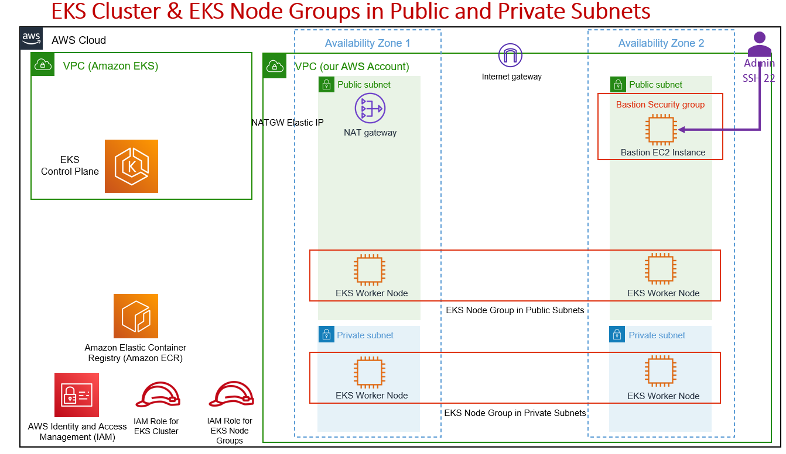

#  Setup a Kubernetes cluster on AWS EKS infrastructure

##  AWS EKS infrastructure architecture

all info about architect Design:




### Step-01: Terraform Settings, Providers & Resource Blocks

In Terraform, settings are values that configure the behavior of Terraform itself, while providers are plugins that allow Terraform to interact with resources in a specific infrastructure.

Settings in Terraform can be specified in the terraform block of a configuration file, or in a separate terraform.tfvars file. Some common settings include:

* **backend**: specifies the backend to use for storing the state of your infrastructure.
* **required_providers**: specifies the providers that are required for the configuration.
* **required_version**: specifies the minimum version of Terraform required to run the configuration.
Providers are responsible for creating and managing resources in a specific infrastructure, such as Amazon Web Services (AWS), Google Cloud Platform (GCP), or Azure. To use a provider in your Terraform configuration, you will need to specify it in the provider block and configure its connection details.

Here is a provider block in a Terraform configuration:

```
# Terraform Settings Block
terraform {
  required_version = ">= 1.0.0"
  required_providers {
    aws = {
      source = "hashicorp/aws"
      version = "4.48.0"
     }
    kubernetes = {
      source = "hashicorp/kubernetes"
      version = "2.16.1"
   
    }      
  }
  # Adding Backend as S3 for Remote State Storage
  backend "s3" {
    bucket = "aws-eks-terraform"
    key    = "dev/eks-cluster/terraform.tfstate"
    region = "us-east-1" 
 
    # For State Locking
    dynamodb_table = "dev-ekscluster"    
  }  
}

# Terraform Provider Block
provider "aws" {
  region = var.aws_region
}
```

### Step-02: Define Input and Local Variables in Terraform

* **Input Variables**

In Terraform, input variables are values that are passed into a configuration when it is applied. They can be used to parameterize a configuration and make it more flexible and reusable.

To define an input variable in Terraform, you can use the variable block in a variables.tf file, or in the root module of your configuration.

Here is an example of how to define an input variable in Terraform: `c2-01-generic-variables.tf`

```
# Input Variables
# AWS Region
variable "aws_region" {
  description = "Region in which AWS Resources to be created"
  type = string
  default = "us-east-1"  
}
# Environment Variable
variable "environment" {
  description = "Environment Variable used as a prefix"
  type = string
  default = "dev"
}
# Business Division
variable "business_divsion" {
  description = "Business Division in the large organization this Infrastructure belongs"
  type = string
  default = "radio"
}
```


`Generic Variables`
```
aws_region = "us-east-1"
environment = "dev"
business_divsion = "radio"
```


* **Local Variables**

In Terraform, local variables are values that are defined within a module and are only accessible within that module. They are useful for encapsulating complex expressions and for reducing duplication of code.

To define a local variable in Terraform, you can use the local block in a module. The syntax for defining a local variable is similar to that of an input variable, but the variable block is replaced with the local block.

Here is define a local variable in Terraform: `c2-02-local-values.tf`

```
# Define Local Values in Terraform
locals {
  owners = var.business_divsion
  environment = var.environment
  name = "${var.business_divsion}-${var.environment}"
  #name = "${local.owners}-${local.environment}"
  common_tags = {
    owners = local.owners
    environment = local.environment
  }
  eks_cluster_name = "${local.name}-${var.cluster_name}"  
} 
```

### Step-03 Design AWS VPC with NAT Gateways using Terraform

A Virtual Private Cloud (VPC) module in Terraform is a self-contained configuration that defines the resources and settings needed to create a VPC in a specific infrastructure.

A VPC module typically includes the following elements:

* Provider configuration: specifies the provider to use for creating the VPC, such as the aws provider for creating an AWS VPC.
* Resources: specifies the resources to create in the VPC, such as subnets, internet gateways, and security groups.
* Input variables: values that are passed into the module when it is called. These can be used to parameterize the module and make it more flexible and reusable.
* Output variables: values that are returned by the module after it is applied. These can be used to access the values of resources created in the VPC, such as the VPC ID or CIDR block.


**Create a VPC Module Terraform Configuration:** `c3-02-vpc-module.tf`
```
# AWS Availability Zones Datasource
data "aws_availability_zones" "available" {
}

# Create VPC Terraform Module
module "vpc" {
  source  = "terraform-aws-modules/vpc/aws"
  version = "3.18.0"
  

  # VPC Basic Details
  name = local.eks_cluster_name
  cidr = var.vpc_cidr_block
  azs             = data.aws_availability_zones.available.names
  public_subnets  = var.vpc_public_subnets
  private_subnets = var.vpc_private_subnets  

  # Database Subnets
  database_subnets = var.vpc_database_subnets
  create_database_subnet_group = var.vpc_create_database_subnet_group
  create_database_subnet_route_table = var.vpc_create_database_subnet_route_table
  # create_database_internet_gateway_route = true
  # create_database_nat_gateway_route = true
  
  # NAT Gateways - Outbound Communication
  enable_nat_gateway = var.vpc_enable_nat_gateway 
  single_nat_gateway = var.vpc_single_nat_gateway

  # VPC DNS Parameters
  enable_dns_hostnames = true
  enable_dns_support   = true

  
  tags = local.common_tags
  vpc_tags = local.common_tags

  # Additional Tags to Subnets
  public_subnet_tags = {
    Type = "Public Subnets"
    "kubernetes.io/role/elb" = 1    
    "kubernetes.io/cluster/${local.eks_cluster_name}" = "shared"        
  }
  private_subnet_tags = {
    Type = "private-subnets"
    "kubernetes.io/role/internal-elb" = 1    
    "kubernetes.io/cluster/${local.eks_cluster_name}" = "shared"    
  }

  database_subnet_tags = {
    Type = "database-subnets"
  }
}

```

**Here is define a VPC variable in Terraform:** `c3-01-vpc-variables.tf`

```
# VPC Input Variables

# VPC Name
variable "vpc_name" {
  description = "VPC Name"
  type = string 
  default = "myvpc"
}

# VPC CIDR Block
variable "vpc_cidr_block" {
  description = "VPC CIDR Block"
  type = string 
  default = "10.0.0.0/16"
}

# VPC Availability Zones
/*
variable "vpc_availability_zones" {
  description = "VPC Availability Zones"
  type = list(string)
  default = ["us-east-1a", "us-east-1b"]
}
*/

# VPC Public Subnets
variable "vpc_public_subnets" {
  description = "VPC Public Subnets"
  type = list(string)
  default = ["10.0.111.0/24", "10.0.112.0/24"]
}

# VPC Private Subnets
variable "vpc_private_subnets" {
  description = "VPC Private Subnets"
  type = list(string)
  default = ["10.0.1.0/24", "10.0.2.0/24"]
}

# VPC Database Subnets
variable "vpc_database_subnets" {
  description = "VPC Database Subnets"
  type = list(string)
  default = ["10.0.151.0/24", "10.0.152.0/24"]
}

# VPC Create Database Subnet Group (True / False)
variable "vpc_create_database_subnet_group" {
  description = "VPC Create Database Subnet Group"
  type = bool
  default = true 
}

# VPC Create Database Subnet Route Table (True or False)
variable "vpc_create_database_subnet_route_table" {
  description = "VPC Create Database Subnet Route Table"
  type = bool
  default = true   
}

  
# VPC Enable NAT Gateway (True or False) 
variable "vpc_enable_nat_gateway" {
  description = "Enable NAT Gateways for Private Subnets Outbound Connections"
  type = bool
  default = true  
}

# VPC Single NAT Gateway (True or False)
variable "vpc_single_nat_gateway" {
  description = "Enable only single NAT Gateway in one Availability Zone to save costs during Taks"
  type = bool
  default = true
}


```


**Here is define a VPC outputs in Terraform:** `c3-03-vpc-outputs.tf`

```
# VPC Output Values

# VPC ID
output "vpc_id" {
  description = "The ID of the VPC"
  value       = module.vpc.vpc_id
}

# VPC CIDR blocks
output "vpc_cidr_block" {
  description = "The CIDR block of the VPC"
  value       = module.vpc.vpc_cidr_block
}

# VPC Private Subnets
output "private_subnets" {
  description = "List of IDs of private subnets"
  value       = module.vpc.private_subnets
}

# VPC Public Subnets
output "public_subnets" {
  description = "List of IDs of public subnets"
  value       = module.vpc.public_subnets
}

# VPC NAT gateway Public IP
output "nat_public_ips" {
  description = "List of public Elastic IPs created for AWS NAT Gateway"
  value       = module.vpc.nat_public_ips
}

# VPC AZs
output "azs" {
  description = "A list of availability zones spefified as argument to this module"
  value       = module.vpc.azs
}

```

`VPC Variables`
```
vpc_name = "myvpc"
vpc_cidr_block = "10.0.0.0/16"
#vpc_availability_zones = ["us-east-1a", "us-east-1b"]
vpc_public_subnets = ["10.0.111.0/24", "10.0.112.0/24"]
vpc_private_subnets = ["10.0.1.0/24", "10.0.2.0/24"]
vpc_database_subnets= ["10.0.151.0/24", "10.0.152.0/24"]
vpc_create_database_subnet_group = true 
vpc_create_database_subnet_route_table = true   
vpc_enable_nat_gateway = true  
vpc_single_nat_gateway = true
```


### Step-04 AWS EC2 Bastion Host in Public Subnet

An Amazon Web Services (AWS) Elastic Compute Cloud (EC2) Bastion Host is a special purpose EC2 instance that allows you to securely connect to other instances in your VPC over the internet.

A Bastion Host is typically placed in a public subnet and can be accessed using Secure Shell (SSH) or Remote Desktop Protocol (RDP) over the internet. It acts as a secure gateway to the other instances in your VPC, which are typically placed in private subnets and are not directly accessible from the internet.


**Here is define ec2bastion-variables in Terraform:** `c4-01-ec2bastion-variables.tf`

```

   
# AWS EC2 Instance Terraform Variables
# EC2 Instance Variables

# AWS EC2 Instance Type
variable "instance_type" {
  description = "EC2 Instance Type"
  type = string
  default = "t3.micro"  
}

# AWS EC2 Instance Key Pair
variable "instance_keypair" {
  description = "AWS EC2 Key pair that need to be associated with EC2 Instance"
  type = string
  default = "eks-terraform-key"
}


```


**Here is define ec2bastion-outputs in Terraform:** `c4-02-ec2bastion-outputs.tf`

```
# AWS EC2 Instance Terraform Outputs
# Public EC2 Instances - Bastion Host

## ec2_bastion_public_instance_ids
output "ec2_bastion_public_instance_ids" {
  description = "List of IDs of instances"
  value       = module.ec2_public.id
}

## ec2_bastion_public_ip
output "ec2_bastion_public_ip" {
  description = "Elastic IP associated to the Bastion Host"
  value       = aws_eip.bastion_eip.public_ip
}


```


**Here is define ec2bastion-securitygroupsin Terraform:** `c4-03-ec2bastion-securitygroups.tf`

```
# AWS EC2 Security Group Terraform Module
# Security Group for Public Bastion Host
module "public_bastion_sg" {
  source  = "terraform-aws-modules/security-group/aws"
  version = "4.16.2"

  name = "${local.name}-public-bastion-sg"
  description = "Security Group with SSH port open for everybody (IPv4 CIDR), egress ports are all world open"
  vpc_id = module.vpc.vpc_id
  # Ingress Rules & CIDR Blocks
  ingress_rules = ["ssh-tcp"]
  ingress_cidr_blocks = ["0.0.0.0/0"]
  # Egress Rule - all-all open
  egress_rules = ["all-all"]
  tags = local.common_tags
}
```


**Here is define a ami-datasource in Terraform:** `c4-04-ami-datasource.tf`

```
# Get latest AMI ID for Amazon Linux2 OS
data "aws_ami" "amzlinux2" {
  most_recent = true
  owners = [ "amazon" ]
  filter {
    name = "name"
    values = [ "amzn2-ami-hvm-*-gp2" ]
  }
  filter {
    name = "root-device-type"
    values = [ "ebs" ]
  }
  filter {
    name = "virtualization-type"
    values = [ "hvm" ]
  }
  filter {
    name = "architecture"
    values = [ "x86_64" ]
  }
}

```


**Here is define ec2bastion-instance in Terraform:** `c4-05-ec2bastion-instance.tf`

```
# AWS EC2 Instance Terraform Module
# Bastion Host - EC2 Instance that will be created in VPC Public Subnet
module "ec2_public" {
  source  = "terraform-aws-modules/ec2-instance/aws"
  version = "4.2.1"
  # insert the required variables here
  name                   = "${local.name}-BastionHost"
  ami                    = data.aws_ami.amzlinux2.id
  instance_type          = var.instance_type
  key_name               = var.instance_keypair
  #monitoring             = true
  subnet_id              = module.vpc.public_subnets[0]
  vpc_security_group_ids = [module.public_bastion_sg.security_group_id]
  tags = local.common_tags
}

```


**Here is define ec2bastion-elasticip in Terraform:** `c4-06-ec2bastion-elasticip.tf`

```
# Create Elastic IP for Bastion Host
# Resource - depends_on Meta-Argument
resource "aws_eip" "bastion_eip" {
  depends_on = [ module.ec2_public, module.vpc ]
  instance = module.ec2_public.id
  vpc      = true
  tags = local.common_tags
}


```


**Here is define ec2bastion-provisioners in Terraform:** `c4-07-ec2bastion-provisioners.tf`

```
# Create a Null Resource and Provisioners
resource "null_resource" "copy_ec2_keys" {
  depends_on = [module.ec2_public]
  # Connection Block for Provisioners to connect to EC2 Instance
  connection {
    type     = "ssh"
    host     = aws_eip.bastion_eip.public_ip    
    user     = "ec2-user"
    password = ""
    private_key = file("private-key/eks-terraform-key.pem")
  }  

## File Provisioner: Copies the terraform-key.pem file to /tmp/terraform-key.pem
  provisioner "file" {
    source      = "private-key/eks-terraform-key.pem"
    destination = "/tmp/eks-terraform-key.pem"
  }
## Remote Exec Provisioner: Using remote-exec provisioner fix the private key permissions on Bastion Host
  provisioner "remote-exec" {
    inline = [
      "sudo chmod 400 /tmp/eks-terraform-key.pem"
    ]
  }
## Local Exec Provisioner:  local-exec provisioner (Creation-Time Provisioner - Triggered during Create Resource)
  provisioner "local-exec" {
    command = "echo VPC created on `date` and VPC ID: ${module.vpc.vpc_id} >> creation-time-vpc-id.txt"
    working_dir = "local-exec-output-files/"
    #on_failure = continue
  }

}


```

`ec2bastion.auto.tfvars`
instance_type = "t3.micro"
instance_keypair = "eks-terraform-key"


### Step-05  Create AWS EKS Cluster and Node Groups

An Amazon Elastic Container Service for Kubernetes (EKS) cluster is a managed Kubernetes service that allows you to run containerized applications on the Amazon Web Services (AWS) cloud. An EKS cluster consists of a set of worker nodes that run the Kubernetes control plane and are used to deploy and manage containerized applications.

Node groups are used to manage the worker nodes in an EKS cluster. A node group is a logical grouping of worker nodes that are created from Amazon Elastic Compute Cloud (EC2) instances and are managed as a single unit. You can create multiple node groups in an EKS cluster to support different workloads or to scale the cluster up or down as needed.


**Define eks-variables in Terraform:** `c5-01-eks-variables.tf`

```
# EKS Cluster Input Variables
variable "cluster_name" {
  description = "Name of the EKS cluster. Also used as a prefix in names of related resources."
  type        = string
  default     = "ekstest"
}

variable "cluster_service_ipv4_cidr" {
  description = "service ipv4 cidr for the kubernetes cluster"
  type        = string
  default     = null
}

variable "cluster_version" {
  description = "Kubernetes minor version to use for the EKS cluster "
  type = string
  default     = null
}
variable "cluster_endpoint_private_access" {
  description = "Indicates whether or not the Amazon EKS private API server endpoint is enabled."
  type        = bool
  default     = false
}

variable "cluster_endpoint_public_access" {
  description = "Indicates whether or not the Amazon EKS public API server endpoint is enabled. When it's set to `false` ensure to have a proper private access with `cluster_endpoint_private_access = true`."
  type        = bool
  default     = true
}

variable "cluster_endpoint_public_access_cidrs" {
  description = "List of CIDR blocks which can access the Amazon EKS public API server endpoint."
  type        = list(string)
  default     = ["0.0.0.0/0"]
}

# EKS Node Group Variables
## Placeholder space you can create if required


```


**Define eks-outputs in Terraform:** `c5-02-eks-outputs.tf`

```
# EKS Cluster Outputs
output "cluster_id" {
  description = "The name/id of the EKS cluster."
  value       = aws_eks_cluster.eks_cluster.id
}

output "cluster_arn" {
  description = "The Amazon Resource Name (ARN) of the cluster."
  value       = aws_eks_cluster.eks_cluster.arn
}

output "cluster_certificate_authority_data" {
  description = "Nested attribute containing certificate-authority-data for your cluster. This is the base64 encoded certificate data required to communicate with your cluster."
  value       = aws_eks_cluster.eks_cluster.certificate_authority[0].data
}

output "cluster_endpoint" {
  description = "The endpoint for your EKS Kubernetes API."
  value       = aws_eks_cluster.eks_cluster.endpoint
}

output "cluster_version" {
  description = "The Kubernetes server version for the EKS cluster."
  value       = aws_eks_cluster.eks_cluster.version
}

output "cluster_iam_role_name" {
  description = "IAM role name of the EKS cluster."
  value       = aws_iam_role.eks_master_role.name 
}

output "cluster_iam_role_arn" {
  description = "IAM role ARN of the EKS cluster."
  value       = aws_iam_role.eks_master_role.arn
}

output "cluster_oidc_issuer_url" {
  description = "The URL on the EKS cluster OIDC Issuer"
  value       = aws_eks_cluster.eks_cluster.identity[0].oidc[0].issuer
}

output "cluster_primary_security_group_id" {
  description = "The cluster primary security group ID created by the EKS cluster."
  value       = aws_eks_cluster.eks_cluster.vpc_config[0].cluster_security_group_id
}


# EKS Node Group Outputs - Public

output "node_group_public_id" {
  description = "Public Node Group ID"
  value       = aws_eks_node_group.eks_ng_public.id
}

output "node_group_public_arn" {
  description = "Public Node Group ARN"
  value       = aws_eks_node_group.eks_ng_public.arn
}

output "node_group_public_status" {
  description = "Public Node Group status"
  value       = aws_eks_node_group.eks_ng_public.status 
}

output "node_group_public_version" {
  description = "Public Node Group Kubernetes Version"
  value       = aws_eks_node_group.eks_ng_public.version
}


# EKS Node Group Outputs - Private

output "node_group_private_id" {
  description = "Node Group 1 ID"
  value       = aws_eks_node_group.eks_ng_private.id
}

output "node_group_private_arn" {
  description = "Private Node Group ARN"
  value       = aws_eks_node_group.eks_ng_private.arn
}

output "node_group_private_status" {
  description = "Private Node Group status"
  value       = aws_eks_node_group.eks_ng_private.status 
}

output "node_group_private_version" {
  description = "Private Node Group Kubernetes Version"
  value       = aws_eks_node_group.eks_ng_private.version
}


```


**Define iamrole-for-eks-cluster in Terraform:** `c5-03-iamrole-for-eks-cluster.tf`

```
# Create IAM Role
resource "aws_iam_role" "eks_master_role" {
  name = "${local.name}-eks-master-role"

  assume_role_policy = <<POLICY
{
  "Version": "2012-10-17",
  "Statement": [
    {
      "Effect": "Allow",
      "Principal": {
        "Service": "eks.amazonaws.com"
      },
      "Action": "sts:AssumeRole"
    }
  ]
}
POLICY
}

# Associate IAM Policy to IAM Role
resource "aws_iam_role_policy_attachment" "eks-AmazonEKSClusterPolicy" {
  policy_arn = "arn:aws:iam::aws:policy/AmazonEKSClusterPolicy"
  role       = aws_iam_role.eks_master_role.name
}

resource "aws_iam_role_policy_attachment" "eks-AmazonEKSVPCResourceController" {
  policy_arn = "arn:aws:iam::aws:policy/AmazonEKSVPCResourceController"
  role       = aws_iam_role.eks_master_role.name
}


```


**Define iamrole-for-eks-nodegroup in Terraform:** `c5-04-iamrole-for-eks-nodegroup.tf`

```# IAM Role for EKS Node Group 
resource "aws_iam_role" "eks_nodegroup_role" {
  name = "${local.name}-eks-nodegroup-role"

  assume_role_policy = jsonencode({
    Statement = [{
      Action = "sts:AssumeRole"
      Effect = "Allow"
      Principal = {
        Service = "ec2.amazonaws.com"
      }
    }]
    Version = "2012-10-17"
  })
}

resource "aws_iam_role_policy_attachment" "eks-AmazonEKSWorkerNodePolicy" {
  policy_arn = "arn:aws:iam::aws:policy/AmazonEKSWorkerNodePolicy"
  role       = aws_iam_role.eks_nodegroup_role.name
}

resource "aws_iam_role_policy_attachment" "eks-AmazonEKS_CNI_Policy" {
  policy_arn = "arn:aws:iam::aws:policy/AmazonEKS_CNI_Policy"
  role       = aws_iam_role.eks_nodegroup_role.name
}

resource "aws_iam_role_policy_attachment" "eks-AmazonEC2ContainerRegistryReadOnly" {
  policy_arn = "arn:aws:iam::aws:policy/AmazonEC2ContainerRegistryReadOnly"
  role       = aws_iam_role.eks_nodegroup_role.name
}

# Autoscaling Full Access
resource "aws_iam_role_policy_attachment" "eks-Autoscaling-Full-Access" {
  policy_arn = "arn:aws:iam::aws:policy/AutoScalingFullAccess"
  role       = aws_iam_role.eks_nodegroup_role.name
}

# CloudWatchAgentServerPolicy for AWS CloudWatch Container Insights
resource "aws_iam_role_policy_attachment" "eks_cloudwatch_container_insights" {
  policy_arn = "arn:aws:iam::aws:policy/CloudWatchAgentServerPolicy"
  role       = aws_iam_role.eks_nodegroup_role.name
}


```


**Here is define securitygroups-eks in Terraform:** `c5-05-securitygroups-eks.tf`

```

# Security Group for EKS Node Group - Placeholder file

```


**Here is define eks-cluster in Terraform:** `c5-06-eks-cluster.tf`

```
# Create AWS EKS Cluster
resource "aws_eks_cluster" "eks_cluster" {
  name     = "${local.name}-${var.cluster_name}"
  role_arn = aws_iam_role.eks_master_role.arn
  version = var.cluster_version

  vpc_config {
    subnet_ids = module.vpc.public_subnets
    endpoint_private_access = var.cluster_endpoint_private_access
    endpoint_public_access  = var.cluster_endpoint_public_access
    public_access_cidrs     = var.cluster_endpoint_public_access_cidrs    
  }

  kubernetes_network_config {
    service_ipv4_cidr = var.cluster_service_ipv4_cidr
  }
  
  # Enable EKS Cluster Control Plane Logging
  enabled_cluster_log_types = ["api", "audit", "authenticator", "controllerManager", "scheduler"]

  # Ensure that IAM Role permissions are created before and deleted after EKS Cluster handling.
  # Otherwise, EKS will not be able to properly delete EKS managed EC2 infrastructure such as Security Groups.
  depends_on = [
    aws_iam_role_policy_attachment.eks-AmazonEKSClusterPolicy,
    aws_iam_role_policy_attachment.eks-AmazonEKSVPCResourceController,
  ]
}


```


**Here is define eks-node-group-public in Terraform:** `c5-07-eks-node-group-public.tf`

```

# Create AWS EKS Node Group - Public
resource "aws_eks_node_group" "eks_ng_public" {
  cluster_name    = aws_eks_cluster.eks_cluster.name

  node_group_name = "${local.name}-eks-ng-public"
  node_role_arn   = aws_iam_role.eks_nodegroup_role.arn
  subnet_ids      = module.vpc.public_subnets
  version = var.cluster_version 
  
  ami_type = "AL2_x86_64"  
  capacity_type = "ON_DEMAND"
  disk_size = 20
  instance_types = ["t3.medium"]
  
  
  remote_access {
    ec2_ssh_key = "eks-terraform-key"
  }

  scaling_config {
    desired_size = 1
    min_size     = 1    
    max_size     = 2
  }

  # Desired max percentage of unavailable worker nodes during node group update.
  update_config {
    max_unavailable = 1    
    #max_unavailable_percentage = 50    # ANY ONE TO USE
  }

  # Ensure that IAM Role permissions are created before and deleted after EKS Node Group handling.
  # Otherwise, EKS will not be able to properly delete EC2 Instances and Elastic Network Interfaces.
  depends_on = [
    aws_iam_role_policy_attachment.eks-AmazonEKSWorkerNodePolicy,
    aws_iam_role_policy_attachment.eks-AmazonEKS_CNI_Policy,
    aws_iam_role_policy_attachment.eks-AmazonEC2ContainerRegistryReadOnly,
    kubernetes_config_map_v1.aws_auth 
  ] 

  tags = {
    Name = "Public-Node-Group"
    # Cluster Autoscaler Tags
    "k8s.io/cluster-autoscaler/${local.eks_cluster_name}" = "owned"
    "k8s.io/cluster-autoscaler/enabled" = "TRUE"	    
  }
}


```


**Here is eks-node-group-private in Terraform:** `c5-08-eks-node-group-private.tf`

```
# Create AWS EKS Node Group - Private
resource "aws_eks_node_group" "eks_ng_private" {
  cluster_name    = aws_eks_cluster.eks_cluster.name

  node_group_name = "${local.name}-eks-ng-private"
  node_role_arn   = aws_iam_role.eks_nodegroup_role.arn
  subnet_ids      = module.vpc.private_subnets
  version = var.cluster_version #(Optional: Defaults to EKS Cluster Kubernetes version)    
  
  ami_type = "AL2_x86_64"  
  capacity_type = "ON_DEMAND"
  disk_size = 20
  instance_types = ["t3.large"]
  
  
  remote_access {
    ec2_ssh_key = "eks-terraform-key"    
  }

  scaling_config {
    desired_size = 2
    min_size     = 2    
    max_size     = 3
  }

  # Desired max percentage of unavailable worker nodes during node group update.
  update_config {
    max_unavailable = 1    
    #max_unavailable_percentage = 50    # ANY ONE TO USE
  }

  # Ensure that IAM Role permissions are created before and deleted after EKS Node Group handling.
  # Otherwise, EKS will not be able to properly delete EC2 Instances and Elastic Network Interfaces.
  depends_on = [
    aws_iam_role_policy_attachment.eks-AmazonEKSWorkerNodePolicy,
    aws_iam_role_policy_attachment.eks-AmazonEKS_CNI_Policy,
    aws_iam_role_policy_attachment.eks-AmazonEC2ContainerRegistryReadOnly,
    kubernetes_config_map_v1.aws_auth 
  ] 
  tags = {
    Name = "Private-Node-Group"
    # Cluster Autoscaler Tags
    "k8s.io/cluster-autoscaler/${local.eks_cluster_name}" = "owned"
    "k8s.io/cluster-autoscaler/enabled" = "TRUE"	    
  }
}


```


`eks.auto.tfvars`
cluster_name = "ekstask1"
cluster_service_ipv4_cidr = "172.20.0.0/16"
cluster_version = "1.24"
cluster_endpoint_private_access = false
cluster_endpoint_public_access = true
cluster_endpoint_public_access_cidrs = ["0.0.0.0/0"]
eks_oidc_root_ca_thumbprint = "9e99a48a9960b14926bb7f3b02e22da2b0ab7280"


### Step-06 Creating an IAM OIDC provider for your cluster

Your cluster has an OpenID Connect (OIDC) issuer URL associated with it. To use AWS Identity and Access Management (IAM) roles for service accounts, an IAM OIDC provider must exist for your cluster.

An IAM (Identity and Access Management) OpenID Connect (OIDC) provider is a service that is integrated with AWS IAM and enables your applications to authenticate users using OIDC identity providers such as Google or Azure AD.

To use an IAM OIDC provider with your Amazon Elastic Container Service for Kubernetes (EKS) cluster, you will need to create an IAM OIDC provider and then configure your EKS cluster to use it as an identity provider.


* Creating an IAM OIDC provider for your cluster
https://docs.aws.amazon.com/eks/latest/userguide/enable-iam-roles-for-service-accounts.html

* Configuring a Kubernetes service account to assume an IAM role
https://docs.aws.amazon.com/eks/latest/userguide/associate-service-account-role.html

* Authenticating users for your cluster from an OpenID Connect identity provider
https://docs.aws.amazon.com/eks/latest/userguide/authenticate-oidc-identity-provider.html

**Here is define iam-oidc-connect-provider-variables in Terraform:** `c6-01-iam-oidc-connect-provider-variables.tf`

* handle thumprint of OIDC
https://marcincuber.medium.com/amazon-eks-with-oidc-provider-iam-roles-for-kubernetes-services-accounts-59015d15cb0c

```
# Input Variables - AWS IAM OIDC Connect Provider


# EKS OIDC ROOT CA Thumbprint - valid until 2037
variable "eks_oidc_root_ca_thumbprint" {
  type        = string
  description = "Thumbprint of Root CA for EKS OIDC"
  default     = "9e99a48a9960b14926bb7f3b02e22da2b0ab7280"
}

#

```
**Here is define iam-oidc-connect-provider in Terraform:** `c6-02-iam-oidc-connect-provider.tf`

```
# Datasource: AWS Partition
# Use this data source to lookup information about the current AWS partition in which Terraform is working
data "aws_partition" "current" {}

# Resource: AWS IAM Open ID Connect Provider
resource "aws_iam_openid_connect_provider" "oidc_provider" {
  client_id_list  = ["sts.${data.aws_partition.current.dns_suffix}"]
  thumbprint_list = [var.eks_oidc_root_ca_thumbprint]
  url             = aws_eks_cluster.eks_cluster.identity[0].oidc[0].issuer

  tags = merge(
    {
      Name = "${var.cluster_name}-eks-irsa"
    },
    local.common_tags
  )
}

# Output: AWS IAM Open ID Connect Provider ARN
output "aws_iam_openid_connect_provider_arn" {
  description = "AWS IAM Open ID Connect Provider ARN"
  value = aws_iam_openid_connect_provider.oidc_provider.arn 
}

# Extract OIDC Provider from OIDC Provider ARN
locals {
    aws_iam_oidc_connect_provider_extract_from_arn = element(split("oidc-provider/", "${aws_iam_openid_connect_provider.oidc_provider.arn}"), 1)
}
# Output: AWS IAM Open ID Connect Provider
output "aws_iam_openid_connect_provider_extract_from_arn" {
  description = "AWS IAM Open ID Connect Provider extract from ARN"
   value = local.aws_iam_oidc_connect_provider_extract_from_arn
}

# Sample Outputs for Reference
/*
aws_iam_openid_connect_provider_arn = "arn:aws:iam::180789647333:oidc-provider/oidc.eks.us-east-1.amazonaws.com/id/A9DED4A4FA341C2A5D985A260650F232"
aws_iam_openid_connect_provider_extract_from_arn = "oidc.eks.us-east-1.amazonaws.com/id/A9DED4A4FA341C2A5D985A260650F232"
*/


/*
Argument Reference

The following arguments are supported:

    url - (Required) The URL of the identity provider. Corresponds to the iss claim.
    client_id_list - (Required) A list of client IDs (also known as audiences). When a mobile or web app registers with an OpenID Connect provider, they establish a value that identifies the application. (This is the value that's sent as the client_id parameter on OAuth requests.)
    thumbprint_list - (Required) A list of server certificate thumbprints for the OpenID Connect (OIDC) identity provider's server certificate(s).
    */
    

```


### Step-07: Kubernetes Povider

The Kubernetes provider is a Terraform plugin that allows you to manage resources in a Kubernetes cluster using Terraform. With the Kubernetes provider, you can use Terraform to create, update, and delete resources in your cluster, such as pods, services, and deployment resources.

To use the Kubernetes provider in your Terraform configuration, you will need to specify the provider block in your configuration file and configure it with the necessary connection information for your cluster.


**define Kubernetes Povider in Terraform:** `c7-01-kubernetes-provider.tf`

```
# Datasource: 
data "aws_eks_cluster_auth" "cluster" {
  name = aws_eks_cluster.eks_cluster.id
}

# Terraform Kubernetes Provider
provider "kubernetes" {
  host = aws_eks_cluster.eks_cluster.endpoint
  cluster_ca_certificate = base64decode(aws_eks_cluster.eks_cluster.certificate_authority[0].data)
  token = data.aws_eks_cluster_auth.cluster.token
}

```
**kubernetes-configmap in Terraform:** `c7-02-kubernetes-configmap.tf`

The **aws-auth** ConfigMap is a configuration file used in Amazon Elastic Container Service for Kubernetes (EKS) to control access to your cluster. It allows you to specify which IAM users, IAM roles, and OIDC identities are allowed to authenticate and access the cluster.

The aws-auth ConfigMap is a YAML file that contains a **mapRoles** and **mapUsers** section, as well as optional mapAccounts and mapGroups sections.


* Enabling IAM user and role access to your cluster
Access to your cluster using AWS Identity and Access Management (IAM); entities is enabled by the AWS IAM Authenticator for Kubernetes, which runs on the Amazon EKS control plane. The authenticator gets its configuration information from the aws-auth ConfigMap. For all aws-auth ConfigMap settings, see Full Configuration Format on GitHub.
https://docs.aws.amazon.com/eks/latest/userguide/add-user-role.html


```
# Get AWS Account ID
data "aws_caller_identity" "current" {}
output "account_id" {
  value = data.aws_caller_identity.current.account_id
}


# Sample Role Format: arn:aws:iam::180789647333:role/hr-dev-eks-nodegroup-role
# Locals Block
locals {
  configmap_roles = [
    {
      #rolearn  = "arn:aws:iam::${data.aws_caller_identity.current.account_id}:role/${aws_iam_role.eks_nodegroup_role.name}"
      rolearn = "${aws_iam_role.eks_nodegroup_role.arn}"      
      username = "system:node:{{EC2PrivateDNSName}}"
      groups   = ["system:bootstrappers", "system:nodes"]
    },
    {
      rolearn  = "${aws_iam_role.eks_admin_role.arn}"
      username = "eks-admin" # Just a place holder name
      groups   = ["system:masters"]
    },    
    {
      rolearn  = "${aws_iam_role.eks_readonly_role.arn}"
      username = "eks-readonly" # Just a place holder name
      #groups   = [ "eks-readonly-group" ]
      # Important Note: The group name specified in clusterrolebinding and in aws-auth configmap groups should be same. 
      groups   = [ "${kubernetes_cluster_role_binding_v1.eksreadonly_clusterrolebinding.subject[0].name}" ]
    },
    {
      rolearn  = "${aws_iam_role.eks_developer_role.arn}"
      username = "eks-developer" # Just a place holder name
      #groups   = [ "eks-developer-group" ]
      # Important Note: The group name specified in clusterrolebinding and in aws-auth configmap groups should be same.       
      groups   = [ "${kubernetes_role_binding_v1.eksdeveloper_rolebinding.subject[0].name}" ]
    },         
  ]
  configmap_users = [
    {
      userarn  = "${aws_iam_user.basic_user.arn}"
      username = "${aws_iam_user.basic_user.name}"
      groups   = ["system:masters"]
    },
    {
      userarn  = "${aws_iam_user.admin_user.arn}"
      username = "${aws_iam_user.admin_user.name}"
      groups   = ["system:masters"]
    },    
  ]    
}
# Resource: Kubernetes Config Map
resource "kubernetes_config_map_v1" "aws_auth" {
  depends_on = [
    aws_eks_cluster.eks_cluster,
    kubernetes_cluster_role_binding_v1.eksreadonly_clusterrolebinding,
    kubernetes_cluster_role_binding_v1.eksdeveloper_clusterrolebinding,
    kubernetes_role_binding_v1.eksdeveloper_rolebinding
      ]
  metadata {
    name      = "aws-auth"
    namespace = "kube-system"
  }
  data = {
    mapRoles = yamlencode(local.configmap_roles)
    mapUsers = yamlencode(local.configmap_users)            
  }  
}


```


### Step-08: Create new AWS Admin and Basic User to access EKS Cluster Resources

To grant an AWS administrator and a basic user access to resources in an Amazon Elastic Container Service for Kubernetes (EKS) cluster, you will need to configure the aws-auth ConfigMap in your cluster to map the IAM users and roles to the cluster.


**Here is define iam-admin-user in Terraform:** `c8-01-iam-admin-user.tf`

```
# Resource: AWS IAM User - Admin User (Has Full AWS Access)
resource "aws_iam_user" "admin_user" {
  name = "${local.name}-eksadmin1"
  path = "/"
  force_destroy = true
  tags = local.common_tags
}

# Resource: Admin Access Policy - Attach it to admin user
resource "aws_iam_user_policy_attachment" "admin_user" {
  user       = aws_iam_user.admin_user.name
  policy_arn = "arn:aws:iam::aws:policy/AdministratorAccess"
}

```
**Here is define iam-basic-user in Terraform:** `c8-02-iam-basic-user.tf`

```
# Resource: AWS IAM User - Basic User (No AWSConsole Access)
resource "aws_iam_user" "basic_user" {
  name = "${local.name}-eksadmin2"
  path = "/"
  force_destroy = true
  tags = local.common_tags
}

# Resource: AWS IAM User Policy - EKS Dashboard Full Access
resource "aws_iam_user_policy" "basic_user_eks_policy" {
  name = "${local.name}-eks-dashboard-full-access-policy"
  user = aws_iam_user.basic_user.name

  # Terraform's "jsonencode" function converts a
  # Terraform expression result to valid JSON syntax.
  policy = jsonencode({
    Version = "2012-10-17"
    Statement = [
      {
        Action = [
          "iam:ListRoles",
          "eks:*",
          "ssm:GetParameter"
        ]
        Effect   = "Allow"
        Resource = "*"
        #Resource = "${aws_eks_cluster.eks_cluster.arn}"
      },
    ]
  })
}


```


### Step-09: Create new AWS Role,Group and User to access EKS Cluster Resources as Admin

**Here is define iam-role-eksadmins in Terraform:** `c9-01-iam-role-eksadmins.tf`

```
# Resource: AWS IAM Role - EKS Admin
resource "aws_iam_role" "eks_admin_role" {
  name = "${local.name}-eks-admin-role"

  # Terraform's "jsonencode" function converts a
  # Terraform expression result to valid JSON syntax.
  assume_role_policy = jsonencode({
    Version = "2012-10-17"
    Statement = [
      {
        Action = "sts:AssumeRole"
        Effect = "Allow"
        Sid    = ""
        Principal = {
          AWS = "arn:aws:iam::${data.aws_caller_identity.current.account_id}:root"
        }
      },
    ]
  })
  inline_policy {
    name = "eks-full-access-policy"

    policy = jsonencode({
      Version = "2012-10-17"
      Statement = [
        {
          Action   = [
            "iam:ListRoles",
            "eks:*",
            "ssm:GetParameter"
          ]
          Effect   = "Allow"
          Resource = "*"
        },
      ]
    })
  }    

  tags = {
    tag-key = "${local.name}-eks-admin-role"
  }
}


```
**Here is define iam-group-and-user-eksadmins in Terraform:** `c9-02-iam-group-and-user-eksadmins.tf`

```
# Resource: AWS IAM Group 
resource "aws_iam_group" "eksadmins_iam_group" {
  name = "${local.name}-eksadmins"
  path = "/"
}

# Resource: AWS IAM Group Policy
resource "aws_iam_group_policy" "eksadmins_iam_group_assumerole_policy" {
  name  = "${local.name}-eksadmins-group-policy"
  group = aws_iam_group.eksadmins_iam_group.name

  # Terraform's "jsonencode" function converts a
  # Terraform expression result to valid JSON syntax.
  policy = jsonencode({
    Version = "2012-10-17"
    Statement = [
      {
        Action = [
          "sts:AssumeRole",
        ]
        Effect   = "Allow"
        Sid    = "AllowAssumeOrganizationAccountRole"
        Resource = "${aws_iam_role.eks_admin_role.arn}"
      },
    ]
  })
}


# Resource: AWS IAM User 
resource "aws_iam_user" "eksadmin_user" {
  name = "${local.name}-eksadmin3"
  path = "/"
  force_destroy = true
  tags = local.common_tags
}

# Resource: AWS IAM Group Membership
resource "aws_iam_group_membership" "eksadmins" {
  name = "${local.name}-eksadmins-group-membership"
  users = [
    aws_iam_user.eksadmin_user.name
  ]
  group = aws_iam_group.eksadmins_iam_group.name
}

```

### Step-10:  Create new AWS Role,Group and User to access EKS Cluster Resources as Read only


**Define iam-role-eksreadonly in Terraform:** `c10-01-iam-role-eksreadonly.tf`

```
# Resource: AWS IAM Role - EKS Read-Only User
resource "aws_iam_role" "eks_readonly_role" {
  name = "${local.name}-eks-readonly-role"

  # Terraform's "jsonencode" function converts a
  # Terraform expression result to valid JSON syntax.
  assume_role_policy = jsonencode({
    Version = "2012-10-17"
    Statement = [
      {
        Action = "sts:AssumeRole"
        Effect = "Allow"
        Sid    = ""
        Principal = {
          AWS = "arn:aws:iam::${data.aws_caller_identity.current.account_id}:root"
        }
      },
    ]
  })
  inline_policy {
    name = "eks-readonly-access-policy"

    policy = jsonencode({
      Version = "2012-10-17"
      Statement = [
        {
          Action   = [
            "iam:ListRoles",
            "ssm:GetParameter",
            "eks:DescribeNodegroup",
            "eks:ListNodegroups",
            "eks:DescribeCluster",
            "eks:ListClusters",
            "eks:AccessKubernetesApi",
            "eks:ListUpdates",
            "eks:ListFargateProfiles",
            "eks:ListIdentityProviderConfigs",
            "eks:ListAddons",
            "eks:DescribeAddonVersions"
          ]
          Effect   = "Allow"
          Resource = "*"
        },
      ]
    })
  }    

  tags = {
    tag-key = "${local.name}-eks-readonly-role"
  }
}


```
**Define iam-group-and-user-eksreadonly in Terraform:** `c10-02-iam-group-and-user-eksreadonly.tf`

```
# Resource: AWS IAM Group 
resource "aws_iam_group" "eksreadonly_iam_group" {
  name = "${local.name}-eksreadonly"
  path = "/"
}

# Resource: AWS IAM Group Policy
resource "aws_iam_group_policy" "eksreadonly_iam_group_assumerole_policy" {
  name  = "${local.name}-eksreadonly-group-policy"
  group = aws_iam_group.eksreadonly_iam_group.name

  # Terraform's "jsonencode" function converts a
  # Terraform expression result to valid JSON syntax.
  policy = jsonencode({
    Version = "2012-10-17"
    Statement = [
      {
        Action = [
          "sts:AssumeRole",
        ]
        Effect   = "Allow"
        Sid    = "AllowAssumeOrganizationAccountRole"
        Resource = "${aws_iam_role.eks_readonly_role.arn}"
      },
    ]
  })
}


# Resource: AWS IAM User 
resource "aws_iam_user" "eksreadonly_user" {
  name = "${local.name}-eksreadonly1"
  path = "/"
  force_destroy = true
  tags = local.common_tags
}

# Resource: AWS IAM Group Membership
resource "aws_iam_group_membership" "eksreadonly" {
  name = "${local.name}-eksreadonly-group-membership"
  users = [
    aws_iam_user.eksreadonly_user.name
  ]
  group = aws_iam_group.eksreadonly_iam_group.name
}

```


**Define clusterrole and clusterrolebinding in Terraform:** `c10-03-k8s-clusterrole-clusterrolebinding.tf`

```
# Resource: Cluster Role
resource "kubernetes_cluster_role_v1" "eksreadonly_clusterrole" {
  metadata {
    name = "${local.name}-eksreadonly-clusterrole"
  }
  rule {
    api_groups = [""] # These come under core APIs
    resources  = ["nodes", "namespaces", "pods", "events", "services"]
    #resources  = ["nodes", "namespaces", "pods", "events", "services", "configmaps", "serviceaccounts"] #Uncomment for additional Testing
    verbs      = ["get", "list"]    
  }
  rule {
    api_groups = ["apps"]
    resources  = ["deployments", "daemonsets", "statefulsets", "replicasets"]
    verbs      = ["get", "list"]    
  }
  rule {
    api_groups = ["batch"]
    resources  = ["jobs"]
    verbs      = ["get", "list"]    
  }  
}

# Resource: Cluster Role Binding
resource "kubernetes_cluster_role_binding_v1" "eksreadonly_clusterrolebinding" {
  metadata {
    name = "${local.name}-eksreadonly-clusterrolebinding"
  }
  role_ref {
    api_group = "rbac.authorization.k8s.io"
    kind      = "ClusterRole"
    name      = kubernetes_cluster_role_v1.eksreadonly_clusterrole.metadata.0.name 
  }
  subject {
    kind      = "Group"
    name      = "eks-readonly-group"
    api_group = "rbac.authorization.k8s.io"
  }
}
 

```


### Step-11:  Create new AWS Role,Group and User to access EKS Cluster Resources for Developers


**Define IAM Role eksdeveloper in Terraform:** `c11-01-iam-role-eksdeveloper.tf`

```
# Resource: AWS IAM Role - EKS Developer User
resource "aws_iam_role" "eks_developer_role" {
  name = "${local.name}-eks-developer-role"

  # Terraform's "jsonencode" function converts a
  # Terraform expression result to valid JSON syntax.
  assume_role_policy = jsonencode({
    Version = "2012-10-17"
    Statement = [
      {
        Action = "sts:AssumeRole"
        Effect = "Allow"
        Sid    = ""
        Principal = {
          AWS = "arn:aws:iam::${data.aws_caller_identity.current.account_id}:root"
        }
      },
    ]
  })
  inline_policy {
    name = "eks-developer-access-policy"

    policy = jsonencode({
      Version = "2012-10-17"
      Statement = [
        {
          Action   = [
            "iam:ListRoles",
            "ssm:GetParameter",
            "eks:DescribeNodegroup",
            "eks:ListNodegroups",
            "eks:DescribeCluster",
            "eks:ListClusters",
            "eks:AccessKubernetesApi",
            "eks:ListUpdates",
            "eks:ListFargateProfiles",
            "eks:ListIdentityProviderConfigs",
            "eks:ListAddons",
            "eks:DescribeAddonVersions"
          ]
          Effect   = "Allow"
          Resource = "*"
        },
      ]
    })
  }    

  tags = {
    tag-key = "${local.name}-eks-developer-role"
  }
}

/*
# Associate IAM Policy to IAM Role
resource "aws_iam_role_policy_attachment" "eks-developrole-s3fullaccess" {
  policy_arn = "arn:aws:iam::aws:policy/AmazonS3FullAccess"
  role       = aws_iam_role.eks_developer_role.name
}

# Associate IAM Policy to IAM Role
resource "aws_iam_role_policy_attachment" "eks-developrole-dynamodbfullaccess" {
  policy_arn = "arn:aws:iam::aws:policy/AmazonDynamoDBFullAccess"
  role       = aws_iam_role.eks_developer_role.name
}
*/

```
**Define IAM-group and USER-eksdevelope in Terraform:** `c11-02-iam-group-and-user-eksdeveloper.tf`

```
# Resource: AWS IAM Group 
resource "aws_iam_group" "eksdeveloper_iam_group" {
  name = "${local.name}-eksdeveloper"
  path = "/"
}

# Resource: AWS IAM Group Policy
resource "aws_iam_group_policy" "eksdeveloper_iam_group_assumerole_policy" {
  name  = "${local.name}-eksdeveloper-group-policy"
  group = aws_iam_group.eksdeveloper_iam_group.name

  # Terraform's "jsonencode" function converts a
  # Terraform expression result to valid JSON syntax.
  policy = jsonencode({
    Version = "2012-10-17"
    Statement = [
      {
        Action = [
          "sts:AssumeRole",
        ]
        Effect   = "Allow"
        Sid    = "AllowAssumeOrganizationAccountRole"
        Resource = "${aws_iam_role.eks_developer_role.arn}"
      },
    ]
  })
}


# Resource: AWS IAM User 
resource "aws_iam_user" "eksdeveloper_user" {
  name = "${local.name}-eksdeveloper1"
  path = "/"
  force_destroy = true
  tags = local.common_tags
}


# Resource: AWS IAM Group Membership
resource "aws_iam_group_membership" "eksdeveloper" {
  name = "${local.name}-eksdeveloper-group-membership"
  users = [
    aws_iam_user.eksdeveloper_user.name
  ]
  group = aws_iam_group.eksdeveloper_iam_group.name
}


```
**Define Clusterrole and Clusterrolebinding in Terraform:** `c11-03-k8s-clusterrole-clusterrolebinding.tf`

```
# Resource: k8s Cluster Role
resource "kubernetes_cluster_role_v1" "eksdeveloper_clusterrole" {
  metadata {
    name = "${local.name}-eksdeveloper-clusterrole"
  }

  rule {
    api_groups = [""]
    resources  = ["nodes", "namespaces", "pods", "events", "services"]
    #resources  = ["nodes", "namespaces", "pods", "events", "services", "configmaps", "serviceaccounts"] #Uncomment for additional Testing
    verbs      = ["get", "list"]    
  }
  rule {
    api_groups = ["apps"]
    resources  = ["deployments", "daemonsets", "statefulsets", "replicasets"]
    verbs      = ["get", "list"]    
  }
  rule {
    api_groups = ["batch"]
    resources  = ["jobs"]
    verbs      = ["get", "list"]    
  }  
}

# Resource: k8s Cluster Role Binding
resource "kubernetes_cluster_role_binding_v1" "eksdeveloper_clusterrolebinding" {
  metadata {
    name = "${local.name}-eksdeveloper-clusterrolebinding"
  }
  role_ref {
    api_group = "rbac.authorization.k8s.io"
    kind      = "ClusterRole"
    name      = kubernetes_cluster_role_v1.eksdeveloper_clusterrole.metadata.0.name 
  }
  subject {
    kind      = "Group"
    name      = "eks-developer-group"
    api_group = "rbac.authorization.k8s.io"
  }
}

```
**Define namespaces in Terraform:** `c11-04-namespaces.tf`

```
# Resource: k8s namespace
resource "kubernetes_namespace_v1" "k8s_dev" {
  metadata {
    name = "dev"
  }
}

```

**Define role rolebinding in Terraform:** `c11-05-k8s-role-rolebinding.tf`

```
# Resource: k8s Role
resource "kubernetes_role_v1" "eksdeveloper_role" {
  #depends_on = [kubernetes_namespace_v1.k8s_dev]
  metadata {
    name = "${local.name}-eksdeveloper-role"
    namespace = kubernetes_namespace_v1.k8s_dev.metadata[0].name 
  }

  rule {
    api_groups     = ["", "extensions", "apps"]
    resources      = ["*"]
    verbs          = ["*"]
  }
  rule {
    api_groups = ["batch"]
    resources  = ["jobs", "cronjobs"]
    verbs      = ["*"]
  }
}

# Resource: k8s Role Binding
resource "kubernetes_role_binding_v1" "eksdeveloper_rolebinding" {
  #depends_on = [kubernetes_namespace_v1.k8s_dev]  
  metadata {
    name      = "${local.name}-eksdeveloper-rolebinding"
    namespace = kubernetes_namespace_v1.k8s_dev.metadata[0].name 
  }
  role_ref {
    api_group = "rbac.authorization.k8s.io"
    kind      = "Role"
    name      = kubernetes_role_v1.eksdeveloper_role.metadata.0.name 
  }
  subject {
    kind      = "Group"
    name      = "eks-developer-group"
    api_group = "rbac.authorization.k8s.io"
  }
}

```


